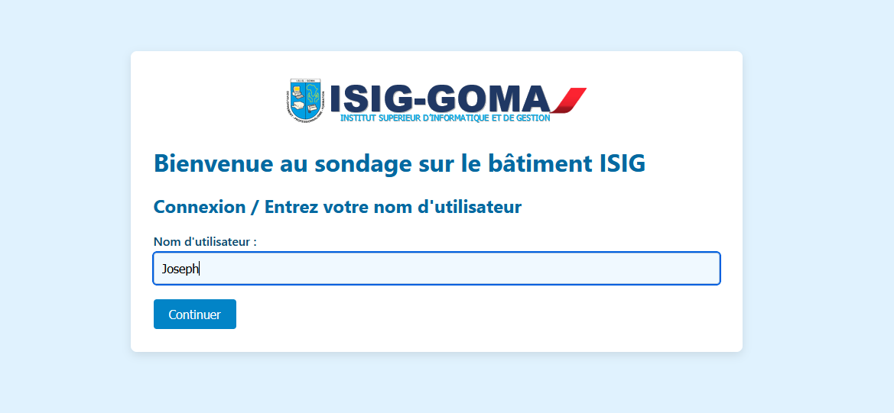
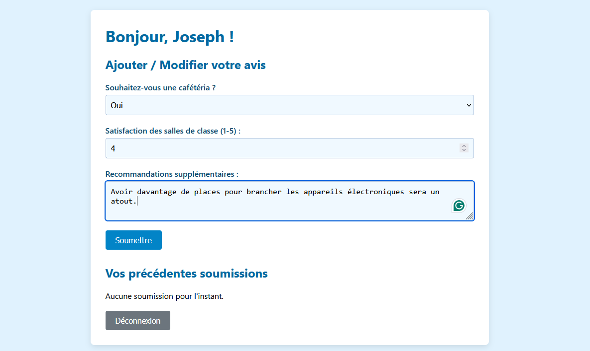
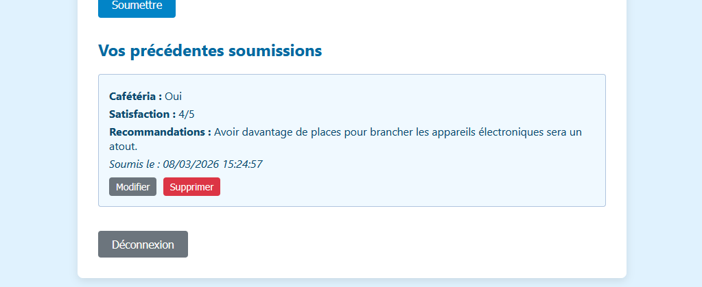
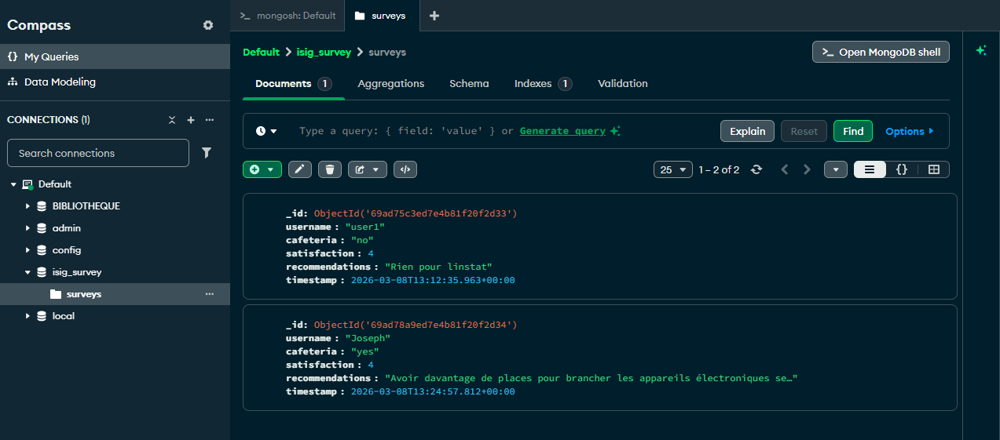

# Guide de l'application de sondage ISIG Goma

Application web simple de collecte d'avis des étudiants sur le bâtiment de l'ISIG Goma, développée en PHP et MongoDB dans le cadre d'un exercice pédagogique.

## 📸 Aperçu de l'application

### Page de connexion

*Page d'accueil avec le logo ISIG - Connexion par nom d'utilisateur*

### Saisie d'un avis

*Formulaire de sondage - cafétéria, satisfaction et recommandations*

### Affichage des avis soumis

*Liste des avis déjà soumis avec options de modification/suppression*

### Données dans MongoDB

*Les avis stockés dans la base de données MongoDB*

## 🚀 Fonctionnalités

- **CRUD complet** (Create, Read, Update, Delete) des avis étudiants
- **Authentification simplifiée** - pas de mot de passe, simple nom d'utilisateur
- **Interface monolingue** en français (adaptée aux étudiants de l'ISIG)
- **Single Page Application** - pas de rechargement de page
- **Thème bleu clair** assorti au site officiel de l'ISIG
- **Logo ISIG** intégré en haut de la page

## 🛠️ Technologies utilisées

- **PHP 8.3.28+** avec extension MongoDB
- **MongoDB** (base de données NoSQL)
- **WAMP Server** (environnement de développement local)
- **HTML5 / CSS3** - design responsive
- **JavaScript vanilla** - pas de framework

## 📁 Structure du projet

```
SURVEY/
├── index.php                 # Point d'entrée unique (SPA)
├── api.php                   # API RESTful (toutes les opérations CRUD)
├── connection/
│   └── db.php                # Connexion à MongoDB
├── webroot/
│   ├── css/
│   │   └── style.css        # Styles (thème bleu ISIG)
│   └── js/
│       └── app.js            # Logique frontend SPA
├── media/
│   ├── images/
│   │   ├── ISIGLogo.png      # Logo de l'université
│   │   ├── LoginPage.png      # Captures d'écran pour le README
│   │   ├── FeedbackInput.png
│   │   ├── PreviousFeeback.png
│   │   └── MongoDBUsers.png
│   └── videos/                # (optionnel)
└── vendor/                    # Bibliothèques Composer
```

## 🔧 Installation

### Prérequis
1. **WAMP** installé avec PHP 8.3.28+
2. **MongoDB** installé et lancé (`mongod`)
3. **Composer** installé

### Étapes d'installation

```bash
# 1. Se placer dans le dossier www de WAMP
cd C:\wamp64\www

# 2. Cloner le dépôt
git clone https://github.com/misakidebugged/ISIG-Survey.git SURVEY

# 3. Installer la bibliothèque MongoDB via Composer
cd SURVEY
composer require mongodb/mongodb

# 4. Placer le logo ISIGLogo.png dans media/images/
# 5. Démarrer WAMP et MongoDB
# 6. Accéder à http://localhost/SURVEY/
```

## 💾 Base de données

La base de données `isig_survey` se crée automatiquement à la première connexion avec la structure suivante :

```javascript
{
  "_id": ObjectId,              // Généré automatiquement
  "username": string,           // Nom de l'étudiant
  "cafeteria": string,          // "yes", "no" ou "maybe"
  "satisfaction": integer,       // Note de 1 à 5
  "recommendations": string,     // Commentaires libres
  "timestamp": ISODate           // Date de soumission
}
```

## 📝 Utilisation

1. **Connexion** : Entrez n'importe quel nom d'utilisateur
2. **Ajout** : Remplissez le formulaire et cliquez sur "Soumettre"
3. **Modification** : Cliquez sur "Modifier" à côté d'un avis existant
4. **Suppression** : Cliquez sur "Supprimer" (confirmation requise)
5. **Déconnexion** : Bouton en bas de page

## 🎓 Objectif pédagogique

Cette application a été créée pour :
- Comprendre le fonctionnement des opérations **CRUD** en PHP
- Apprendre à interagir avec **MongoDB** depuis PHP
- Développer une **Single Page Application** sans framework
- Mettre en pratique la gestion de sessions PHP
- Découvrir le développement full-stack (frontend + backend)

## 📄 Licence

Projet éducatif - Libre d'utilisation pour l'apprentissage

---

**Exercice réalisé à l'ISIG Goma (Institut Supérieur d'Informatique et de Gestion de Goma)**  
*Cours : Développement Web*

---

## 🔗 Liens utiles
- [Documentation MongoDB PHP](https://www.php.net/manual/en/set.mongodb.php)
- [WAMP Server](https://www.wampserver.com/)
- [Composer](https://getcomposer.org/)